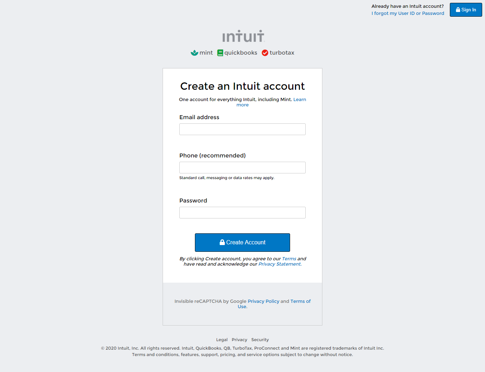

# HTML-Forms

This project is the second in the HTML/CSS module at Microverse
It consists of building an HTML document that matches the appearance of mint.com’s signup page.

## Built With

- HTML
- CSS

## Authors

👤 **David YAO**

- GitHub: [@daviidy](https://github.com/daviidy)

👤 **Silas Kalu**

- GitHub: [@cyonii](https://github.com/cyonii)

## 🤝 Contributing

Contributions, issues, and feature requests are welcome!

Feel free to check the [issues page](issues/).

## Show your support

Give a ⭐️ if you like this project!
